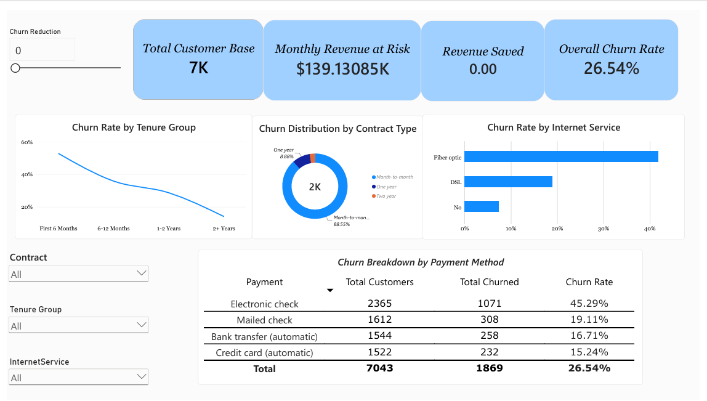
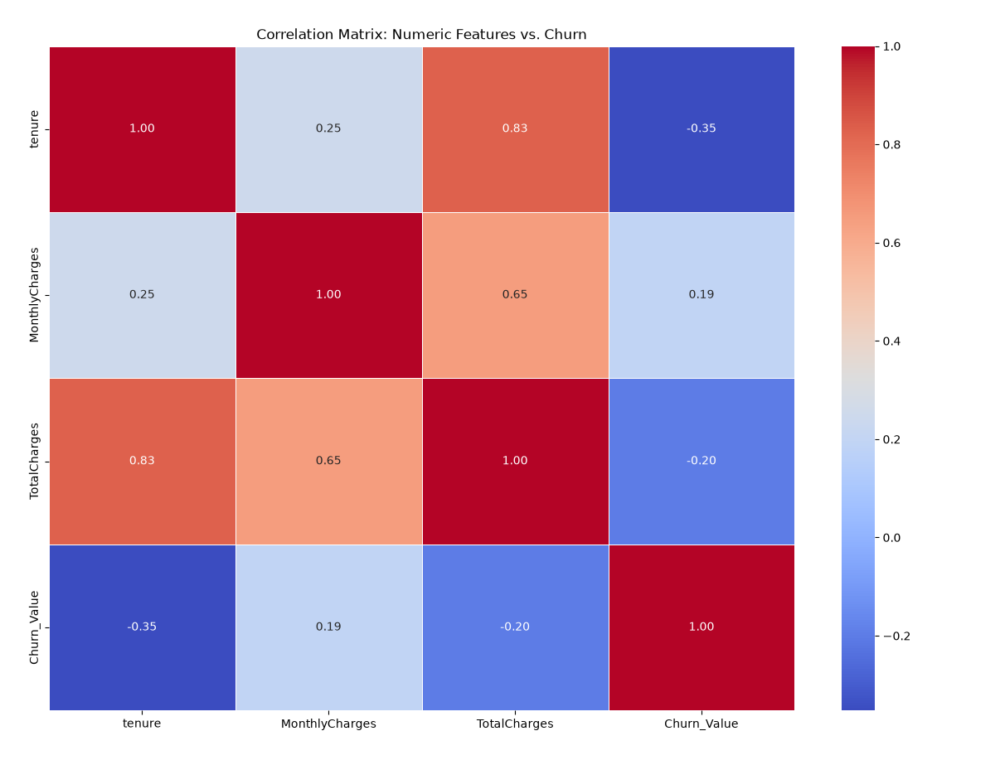

# 📉 Customer Churn & Retention Analytics

## 🎯 Business Problem
A telecommunications provider is experiencing high customer turnover. Management requires a data-driven understanding of the primary drivers behind this attrition to implement proactive, targeted retention strategies and reduce revenue leakage.

## 📈 Interactive Power BI Dashboard
*(Highlights demographic concentration and the extreme churn risk of month-to-month contracts.)*

## 🛠️ Methodology & Tools
* **Data Processing:** Python (Pandas, NumPy) for data cleaning, handling missing values, and type conversion.
* **Statistical Analysis:** Python (Seaborn, Matplotlib) for generating correlation matrices.
* **Business Intelligence:** Power Query and Power BI for interactive visualization and demographic segmentation.

## 🧠 Key Findings & Statistical Proof
*(The heatmap mathematically validates our dashboard findings: demonstrating a strong negative correlation (-0.35) between tenure and churn.)*

* **The Tenure Effect:** A statistical correlation matrix mathematically confirmed a negative relationship (**-0.35**) between tenure and churn. The highest risk of attrition occurs within the first 6 months.
* **Contract Vulnerability:** Customers on month-to-month contracts churn at a massive **42.71%**, compared to just 2.83% for two-year contracts.
* **Payment Friction:** Users paying via Electronic Check have a disproportionately high churn rate (**45.29%**) compared to automated payment methods like Credit Cards (15.24%).

## 💡 Strategic Recommendations
* **Incentivize Auto-Pay:** Implement a minor monthly discount or loyalty points to transition users away from Electronic Checks toward Credit Card or Bank Transfer automation.
* **First 6-Month Nurture:** Deploy targeted onboarding campaigns and proactive customer success check-ins during the first 180 days to push customers past the critical drop-off window.
* **Contract Upgrades:** Identify high-risk month-to-month users and offer localized upgrade incentives to lock them into one-year contracts.
